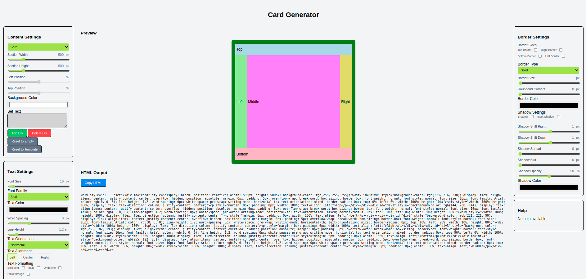

# Card Generator

A web app that generates customizable HTML cards with different styling options.



## Core Functions Explained

1. `state.js` - Stores all settings and data

   - Think of it as a big settings file that remembers all your choices
   - Contains default values for new cards and divs
   - All changes to the app go through here first

2. `generateHTML.js` - Creates the visual output

   - Takes all settings from state and turns them into visible elements
   - Handles how things look on screen
   - Applies all styling (colors, fonts, borders, etc.)

3. `main.js` - Controls everything

   - Listens for any changes you make (like moving sliders)
   - Updates the state when you change settings
   - Tells generateHTML to refresh the preview
   - Keeps UI elements in sync with current settings

4. `htmlElements.js` - Defines all settings controls
   - Lists all sliders, checkboxes, and inputs
   - Connects HTML elements to state properties
   - Makes it easy to add new settings

## How to Add New Settings

1. **Update State** (`state.js`)

   ```javascript
   // Add your new setting to the appropriate section in divTemplate
   textSettings: {
     // existing settings...
     myNewSetting: "defaultValue",
   }
   ```

2. **Add HTML Control** (`index.html`)

   ```html
   <!-- Add in the appropriate settings section -->
   <div>
     <label for="myNewSettingControl">My New Setting</label>
     <input type="range" id="myNewSettingControl" min="0" max="100" value="50" />
     <span id="myNewSettingControlValue">50</span>
     <span>units</span>
   </div>
   ```

3. **Register Control** (`htmlElements.js`)

   ```javascript
   // Add to allElements array
   {
     elementID: "myNewSettingControl",
     eventType: "input",  // or "change" for checkboxes
     inputType: "range",  // or "checkbox", "color", "select"
     stateKey: ["sectionName", "myNewSetting"],
   }
   ```

4. **Apply Setting** (`generateHTML.js`)
   ```javascript
   // Add in createSectionElement function where appropriate
   if (!isCard) {
     element.style.myNewCssProperty = `${section.sectionName.myNewSetting}unit`;
   }
   ```

## Local Development

Run a local web server:

```bash
python3 -m http.server 8000
```

Then open http://localhost:8000

## License

This project is completely free and open source. You are free to:
- Use, share, and copy the game for any purpose
- Modify and adapt the code as you wish
- Distribute your own versions
- Use it as a basis for your own projects

No attribution required. No restrictions whatsoever. Enjoy the game and do whatever you want with it!
